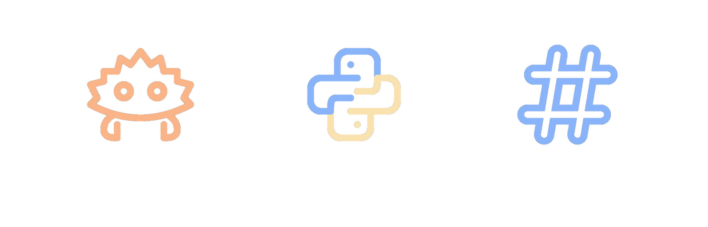

<h1 align=center>
  Simple White Canary
</h1>

  I'm <strong>Horizon Witiwicky</strong> or <strong>Swcy</strong>, a 19 year old software developer looking for things to do and escape boredom.

 

<h1 align=center>
  My Projects:
</h1>
<table align=center>
  <td style="padding: 0; border: 1px solid #0D1117">
    
  </td>
  <td>
  <h1>
    Working now.
  </h1>
    

      since: 10/7/2024.
    

  </td>
</table>
 
<h1 align=center>
  Software Developer:
</h1>
<table align=center>
  <td style="padding: 0; width=50%">
    <h2>
      Languages.
    </h2>
  </td>
  <td style="padding: 0; width=50%">
    
  </td>
</table>
<table align=center>
  <td style="padding: 0; width=50%">
    
  </td>
  <td>
    <h2>
      Technologies.
    </h2>
  </td>
</table>
 
<h1 align=center>
  Stats:
</h1>
<table align=center>
  <td style="padding: 0; width=50%">
    
  </td>
  <td style="padding: 0; width=50%">
    
  </td>
</table>

